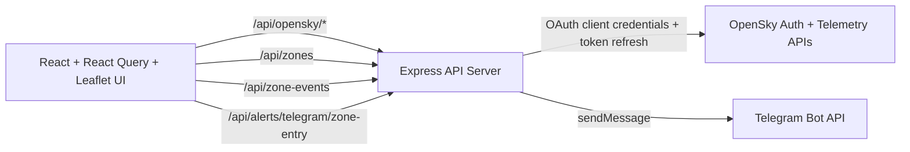

# SkyTrace

SkyTrace is a full-stack airspace monitoring application built for the Dominion Dynamics software engineer technical assessment. It tracks live aircraft telemetry from OpenSky, visualizes a selected aircraft on an interactive map, lets the operator draw geofenced monitoring zones, and sends Telegram alerts when the aircraft enters a saved zone.

The goal of the submission is not only to satisfy the problem statement, but to show end-to-end system design, practical engineering judgment, and clear communication of architecture and tradeoffs.

## Why this submission is stronger than a minimum solution

- Full-stack delivery: React frontend, Node/Express backend, proxy/auth helpers, alerting service, and tests.
- Explicit system boundaries: the browser never handles OpenSky credentials or Telegram bot secrets.
- Operator-focused UX: clear loading states, saved-zone controls, event log, flight popup, notifications, and touch-specific gestures.
- Practical alerting model: per-zone Telegram controls and cooldowns prevent noisy duplicate notifications.

## Core capabilities

- Automatically finds the next aircraft in motion from the live OpenSky feed.
- Allows manual ICAO24 selection when a specific aircraft should be tracked.
- Renders the aircraft on a live Leaflet map with path history and telemetry popup.
- Lets the operator draw, select, delete, and manage multiple saved zones.
- Persists saved zones through the backend so the monitoring setup survives refreshes and restarts.
- Detects zone entry and exit events client-side and persists the event log through the backend.
- Sends Telegram notifications from the backend on zone entry.
- Supports touch-specific map behavior: a single touch hides the right-hand panel and a touch double-tap restores it.

## Architecture



### Frontend responsibilities

- Poll the live telemetry feed with React Query.
- Maintain operator interaction state: tracked aircraft, zone geometry, log visibility, notifications, and touch behavior.
- Hydrate persisted saved zones from the backend and save zone changes back through the API.
- Hydrate persisted zone event history from the backend and save new log entries back through the API.
- Detect whether the tracked aircraft is inside any saved zone.
- Trigger a backend Telegram request only when the aircraft crosses into a zone that has alerts enabled.

### Backend responsibilities

- Proxy all OpenSky traffic so secrets remain server-side.
- Persist saved zones and zone event history to the server filesystem through simple JSON-backed stores.
- Manage OAuth token refresh and retry once after upstream `401` responses.
- Send Telegram notifications from a protected backend-only service.

## Data model and state design

### Saved zones

Each zone is stored as an object rather than only a raw polygon array:

```js
{
	points: [[lat, lng], [lat, lng], [lat, lng]],
	telegramAlertsEnabled: true
}
```

This model leaves room for future growth such as user-defined labels, severity levels, or notification destinations without replacing the core zone structure.

Saved zones are persisted through the backend as normalized JSON so a refresh keeps the operator's monitoring layout intact.

### Zone event log

Each zone event is stored as a normalized object:

```js
{
	id: "evt-123",
	callsign: "BAW123",
	position: [lat, lng],
	timestamp: 1710000000000,
	type: "entered",
	zoneIndex: 0
}
```

The backend persists these events so the entry and exit history survives reloads and local server restarts just like the saved zone geometry.

### Event flow

1. React Query polls OpenSky for all traffic and the currently tracked aircraft.
2. The app derives the current marker position.
3. Polygon hit-testing determines which saved zones are active.
4. When the aircraft crosses from outside to inside a zone, the UI:
   - shows an in-app notification,
   - writes an event-log entry,
   - conditionally calls the Telegram backend route.
5. The backend applies cooldown logic and sends the Telegram message if alerts are enabled and configured.
6. Zone edits and event-log updates are written back to the server so the monitoring state survives reloads.

## Key tradeoffs

- Zone entry detection stays in the frontend.
  This keeps the demo simple and responsive, but a production system with multiple operators would likely move authoritative geofence evaluation to the backend or an event-processing service.

- File-backed persistence instead of a database.
  This adds a real end-to-end persistence path for both monitoring zones and zone event history without introducing database setup overhead inside the assessment window. A production version would persist zones and audit history in a proper datastore.

- Express instead of Django.
  The assessment favored React and Python/Django familiarity, but the current stack let me deliver a cohesive, testable system quickly while still demonstrating full-stack design discipline.

- Polling instead of a stream.
  Polling is operationally simpler for the evaluation timeframe. A production-grade version could move to WebSockets or a streaming pipeline if latency or scale became important.

## Performance considerations

- React Query handles polling cadence and request lifecycle cleanly.
- OpenSky traffic discovery and tracked-aircraft polling are separated so the app only fetches higher-frequency telemetry for the active aircraft.
- Flight history is capped to a fixed number of points to avoid unbounded client growth.
- Telegram alerts use a cooldown to reduce repeated network chatter when aircraft remain inside the same zone.

## Project structure

```text
src/
	App.jsx                   Main orchestration for telemetry, zones, alerts, and map UI
	BrandLogo.jsx             Product mark used in status and brand panels
	FlightPopup.jsx           Aircraft telemetry popup card
	flightMarkerIcon.js       Leaflet aircraft marker construction
	zone-utils.js             Polygon and event-log helpers
	components/
		NotificationStack.jsx   In-app notification toasts
		SavedZonesPanel.jsx     Saved-zone controls and Telegram toggles
		TrackingForm.jsx        Manual ICAO24 tracking form
		ZoneLogPanel.jsx        Entry and exit history panel
	hooks/
		useAircraftTracking.js  Telemetry polling and tracked-aircraft state
		useFlightPath.js        Recent path state and popup visibility
		useNotifications.js     Toast notification state
		useSavedZones.js        Saved-zone hydration and persistence
		useZoneAlerts.js        Zone transition detection and alert side effects
		useZoneEventLog.js      Zone history hydration and persistence
	map/
		MapTouchToolbarController.jsx Touch-first toolbar hide/show behavior
		PolygonDrawingLayer.jsx      Polygon rendering and drawing interactions
server/
	index.js                  Express bootstrap and mode selection
	routes.js                 API route registration
	opensky-auth.js           OAuth token refresh and cache
	opensky-proxy.js          OpenSky proxy and retry logic
	telegram-alerts.js        Telegram message formatting and delivery service
	zone-event-store.js       File-backed zone entry and exit log persistence
	zone-store.js             File-backed saved zone persistence and normalization
	*.test.js                 Node test coverage for backend helpers
```

## Local development

Required `.env` values:

- `OPENSKY_AUTH_URL`
- `OPENSKY_CLIENT_ID`
- `OPENSKY_CLIENT_SECRET`

Optional `.env` values:

- `OPENSKY_TOKEN_SCOPE`
- `OPENSKY_TOKEN_AUDIENCE`
- `OPENSKY_TOKEN_GRANT_TYPE` defaults to `client_credentials`
- `API_PORT` defaults to `3001`
- `PORT` defaults to `3000`
- `TELEGRAM_ALERTS_ENABLED=true` to enable Telegram delivery
- `TELEGRAM_BOT_TOKEN`
- `TELEGRAM_CHAT_ID`
- `TELEGRAM_ALERT_COOLDOWN_MS` defaults to `60000`

Install and run:

```bash
npm install
npm run dev
```

This starts both the Vite frontend and the local API server. The browser only talks to the Node server via `/api/*` routes.

## Production run

```bash
npm run build
npm run start
```

In production mode the Node server serves the built SPA from `dist` and preserves the same backend API surface.

## Tests

```bash
npm test
```

The test suite covers:

- OpenSky token refresh caching and retry behavior
- frontend build serving failure behavior
- Telegram formatting and cooldown logic
- saved zone normalization and file persistence behavior
- zone event log normalization and file persistence behavior

## Telegram alert setup

1. Create a Telegram bot with BotFather.
2. Get the destination chat ID for the target user, group, or channel.
3. Add `TELEGRAM_ALERTS_ENABLED=true`, `TELEGRAM_BOT_TOKEN`, and `TELEGRAM_CHAT_ID` to `.env`.
4. Restart the API server.

Telegram messages are sent from the backend only. The token is never exposed to the browser.

## Video demo

diverfloyd.ddns.net/skytrace.mp4
